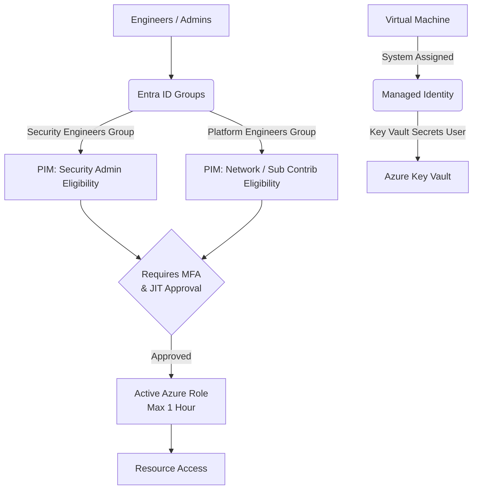

# Architecture Overview

```mermaid
architecture-beta
    group azure(cloud)[Azure / Entra ID]
    
    service entra(server)[Entra ID] in azure
    service pim(key)[Privileged Identity\\Management JIT] in azure
    service policy(book)[Azure Policy Guardrails] in azure
    
    group network_hub(server)[Hub VNet] in azure
    
    group network_spoke(server)[Spoke VNet] in azure
    service app(server)[App Subnet\\(Linux VM w/ Identity)] in network_spoke
    service data(database)[Data Subnet\\(Key Vault, Storage)] in network_spoke
    
    entra -- pim : Issues Roles
    pim -- app : JIT Access
    pim -- data : JIT Access
    
    app -- data : Managed Identity\\No Secrets
    policy -- network_spoke : Enforces HTTPs/Deny Public IPs
```

### Identity and Access Management Flow

```mermaid
graph TD
    A[Engineers / Admins] --> B(Entra ID Groups)
    B -->|Security Engineers Group| C[PIM: Security Admin Eligibility]
    B -->|Platform Engineers Group| D[PIM: Network / Sub Contrib Eligibility]
    C --> E{Requires MFA<br>& JIT Approval}
    D --> E
    E -->|Approved| F[Active Azure Role <br> Max 1 Hour]
    F --> G[Resource Access]
    
    H[Virtual Machine] -->|System Assigned| I(Managed Identity)
    I -->|Key Vault Secrets User| J[Azure Key Vault]
```
